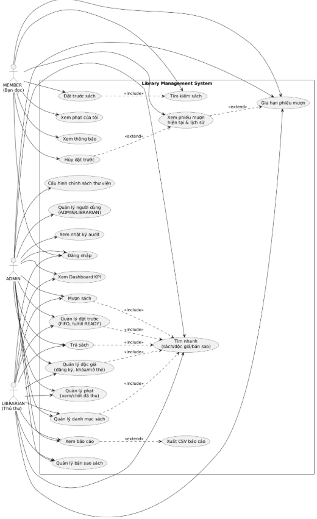
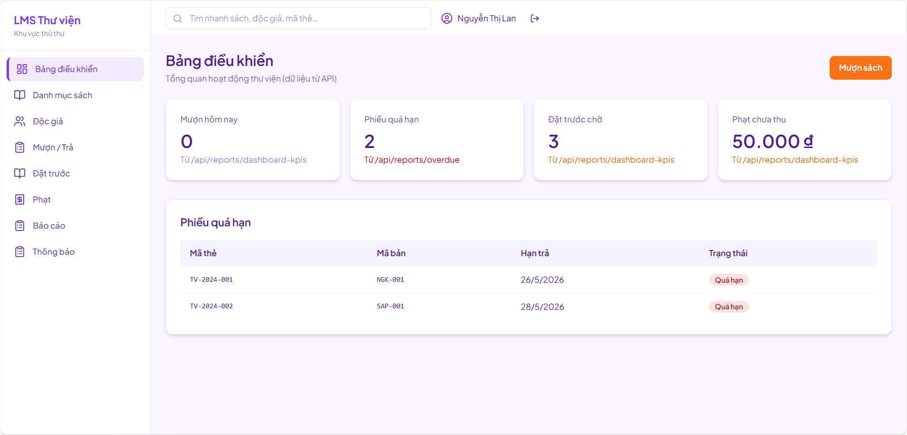
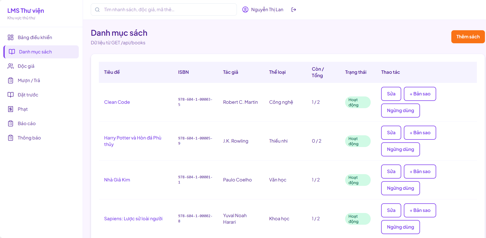
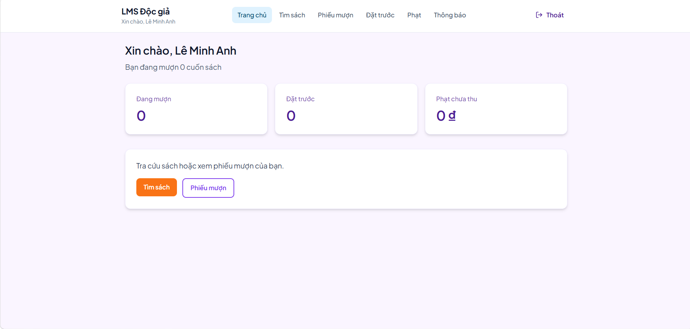
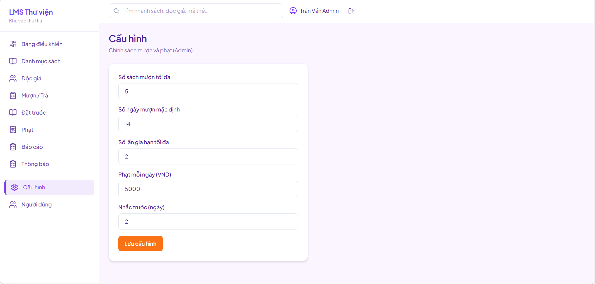

# Library Management System (LMS)

## Project Description

Hệ thống quản lý thư viện (LMS) hỗ trợ vận hành thư viện qua web: quản lý danh mục sách và bản sao, hồ sơ độc giả, mượn/trả tại quầy, đặt trước (FIFO), phạt trễ hạn, báo cáo và khu quản trị.

Monorepo gồm:

| Thư mục               | Mô tả                                                    |
| --------------------- | -------------------------------------------------------- |
| `apps/library-api`    | REST API — Spring Boot 3, JWT, PostgreSQL                |
| `apps/library-web`    | Giao diện React — thủ thư, độc giả, admin                |
| `apps/library-domain` | Logic nghiệp vụ thuần (policy, phạt, hàng đợi đặt trước) |

**Vai trò người dùng:** `ADMIN` (quản trị), `LIBRARIAN` (thủ thư), `MEMBER` (độc giả).

---

## Installation & Setup

### Yêu cầu

- **Java 21**, **Maven 3.9+**
- **Node.js 18+**, **npm**
- **Docker Desktop** (PostgreSQL)

### 1. Clone Repository

```bash
git clone https://github.com/NguyenDuong1509/Library-Management-System
cd Library-Management-System
```

### 2. Backend Setup

**Tạo file env (bắt buộc):**

cd apps/library-api
copy .env.example .env # Windows

# cp .env.example .env # Linux/macOS

```
cd apps/library-api
docker compose up -d
```

**Build và chạy API:**

```bash
cd ../..
mvn -pl apps/library-domain,apps/library-api -am install -DskipTests
mvn -pl apps/library-api spring-boot:run
```

- API: [http://localhost:8080](http://localhost:8080)
- Health check: [http://localhost:8080/actuator/health](http://localhost:8080/actuator/health)

**Chạy nhanh không Docker (H2, dev):**

```bash
cd apps/library-api
mvn spring-boot:run "-Dspring-boot.run.arguments=--spring.profiles.active=local"
```

### 3. Frontend Setup

```bash
cd apps/library-web
copy .env.example .env
npm install
npm run dev
```

- Web: [http://localhost:5173](http://localhost:5173)

### 4. Admin Panel Setup

1. Chạy backend và frontend (bước 2 & 3).
2. Mở [http://localhost:5173/dang-nhap](http://localhost:5173/dang-nhap)
3. Đăng nhập tài khoản **ADMIN**:

| Email                               | Mật khẩu |
| ----------------------------------- | -------- |
| [admin@lms.vn](mailto:admin@lms.vn) | admin123 |

1. Truy cập:

- **Cấu hình chính sách:** `/admin/cau-hinh`
- **Quản lý người dùng:** `/admin/users`

Tài khoản demo khác:

| Vai trò | Email                                 | Mật khẩu  |
| ------- | ------------------------------------- | --------- |
| Thủ thư | [thuthu@lms.vn](mailto:thuthu@lms.vn) | thuthu123 |
| Độc giả | [docgia@lms.vn](mailto:docgia@lms.vn) | docgia123 |

---

## Technologies Used

| Layer                | Stack                                                            |
| -------------------- | ---------------------------------------------------------------- |
| **Backend**          | Java 21, Spring Boot 3.4, Spring Security (JWT), Spring Data JPA |
| **Database**         | PostgreSQL 16, Flyway                                            |
| **Domain**           | Maven module thuần (`library-domain`)                            |
| **Frontend**         | React 18, TypeScript, Vite, Tailwind CSS v4, React Router        |
| **DevOps / Tooling** | Docker Compose, Maven, npm                                       |

---

## Main Features

### Khu thủ thư (`/thu-thu`)

- Dashboard KPI — mượn trong ngày, quá hạn, đặt trước, phạt
- Danh mục sách — CRUD đầu sách, slug URL, bản sao, ẩn/hiện đầu sách
- Quản lý độc giả — đăng ký thẻ, khóa/mở thẻ
- Mượn / trả / gia hạn — tra cứu mã thẻ & mã bản sao
- Đặt trước — hàng đợi FIFO, nhận sách khi READY
- Phạt — danh sách chưa thu, ghi nhận đã thu
- Báo cáo — quá hạn, top sách, phạt; export CSV
- Tìm nhanh — sách, độc giả, bản sao trên header

### Cổng độc giả (`/doc-gia`)

- Tìm sách, xem phiếu mượn & lịch sử
- Tự đặt trước / hủy, gia hạn phiếu của mình
- Xem phạt và thông báo

### Quản trị (`/admin`)

- Cấu hình chính sách — số sách mượn tối đa, ngày mượn, phạt/ngày, …
- Quản lý user ADMIN/LIBRARIAN, audit log

---

## Overview Use Case

## 

## Website screenshot

| Màn hình            | Mô tả                                                  |
| ------------------- | ------------------------------------------------------ |
| _Dashboard thủ thư_ |    |
| _Danh mục sách_     |    |
| _Cổng độc giả_      |      |
| _Admin — Cấu hình_  |  |
